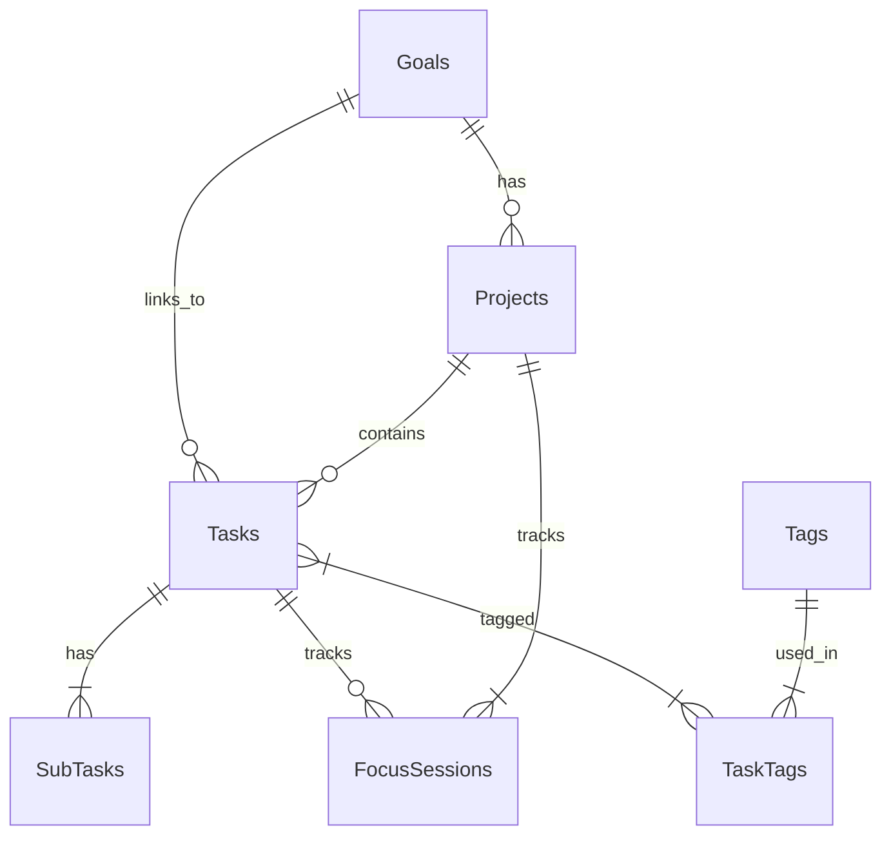

# Chronos Architecture

## High-Level Overview
- **Clean Architecture**: Separation of concerns (data, application, presentation).
- **Reactive UI**: Riverpod providers for streams/states.

```
Presentation (features/)
├── dashboard/     # Metrics, cards, dialogs
│   └── widgets/   # Reusable dashboard components
├── timeline/      # Task list, filters
├── goals/         # Progress bars, lists
├── focus/         # Timer UI
└── settings/      # Forms, toggles

Application (controllers)
├── task_controller.dart
├── focus_session_controller.dart
├── quick_add_controller.dart
├── sub_task_controller.dart
└── recurrence_coordinator.dart  # Handles RRULE expansion

Data Layer
├── Repositories (chronos_repositories.dart)
├── DAOs (daos/)
└── DB Schema (Goals → Projects → Tasks → SubTasks)

Core/Shared
├── Routing (GoRouter)
├── Theme
├── Widgets (SectionCard)
└── Utils (recurrence_utils.dart)
```

## Data Flow
1. **DB → Streams**: Drift queries → Riverpod streams → UI rebuilds.
2. **User Actions**: Controllers → Repository → DB upsert/delete.
3. **Recurrence**: Bootstrap generates instances on app start/completion.

## Key Providers
- `tasksStreamProvider`, `goalsStreamProvider`, etc.
- `appRouterProvider`
- Controllers injected via providers.

## Database Schema


## Extensibility
- Add new features under `features/`.
- Extend DB tables/DAOs.
- New providers in `application/providers.dart`.

